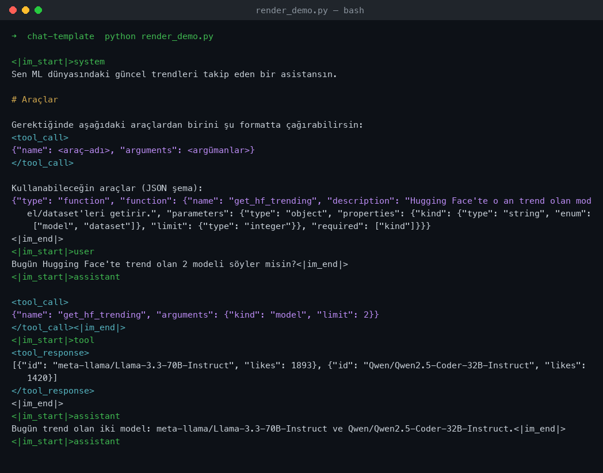

# Custom Chat Template (Jinja2)

Bir dil modelinin **system / user / assistant / tool** mesajlarını doğru ayırt
edebilmesi ve tool-calling (function calling) çağrılarını beklenen formatta
üretebilmesi için yazdığım ChatML tarzı Jinja2 sohbet şablonu.

## Dosyalar

| Dosya | Görev |
|-------|-------|
| `chat_template.jinja` | Asıl şablon. Rolleri ve araç çağrılarını sarmalar. |
| `render_demo.py` | Şablonu örnek bir konuşma ile render edip ham çıktıyı basar. |

## Şablon ne yapıyor?

- **Roller:** `system`, `user`, `assistant`, `tool` — her biri `<|im_start|>rol ... <|im_end|>` bloğuna sarılır (ChatML).
- **Tool calling:** `tools` verildiğinde araç tanımları (JSON şema) system mesajının içine gömülür. Modelin araç çağrısı `<tool_call>{...}</tool_call>`, aracın dönen sonucu `<tool_response>...</tool_response>` bloğuna yazılır.
- **`add_generation_prompt`:** `True` ise sona `<|im_start|>assistant\n` eklenir; model buradan devam eder.

## Çalıştırma

```bash
pip install -r requirements.txt
python render_demo.py
```



Örnek çıktı (kısaltılmış):

```
<|im_start|>system
Sen ML dünyasındaki güncel trendleri takip eden bir asistansın.

# Araçlar
...
<|im_end|>
<|im_start|>user
Bugün Hugging Face'te trend olan 2 modeli söyler misin?<|im_end|>
<|im_start|>assistant

<tool_call>
{"name": "get_hf_trending", "arguments": {"kind": "model", "limit": 2}}
</tool_call><|im_end|>
<|im_start|>tool
<tool_response>
[{"id": "meta-llama/Llama-3.3-70B-Instruct", "likes": 1893}, ...]
</tool_response>
<|im_end|>
<|im_start|>assistant
Bugün trend olan iki model: ...<|im_end|>
<|im_start|>assistant
```

## Bir tokenizer'a bağlama

```python
from transformers import AutoTokenizer

tok = AutoTokenizer.from_pretrained("Qwen/Qwen2.5-0.5B-Instruct")
tok.chat_template = open("chat_template.jinja", encoding="utf-8").read()

text = tok.apply_chat_template(
    messages,               # {"role": ..., "content": ...} listesi
    tools=TOOLS,            # OpenAI uyumlu function tanımları
    add_generation_prompt=True,
    tokenize=False,
)
```

## Notlar

- Şablon [Hugging Face chat template dökümantasyonundaki](https://huggingface.co/docs/transformers/main/en/chat_templating) ChatML yaklaşımını temel alıyor, üzerine tool-calling ekledim.
- `render_demo.py` içinde Jinja2'nin yerleşik `tojson` filtresi HTML-escape yaptığı için (`<` → `&lt;`), transformers ile aynı davranışı vermesi adına filtreyi düz `json.dumps` ile değiştirdim. `apply_chat_template` kullanırken buna gerek yok.
