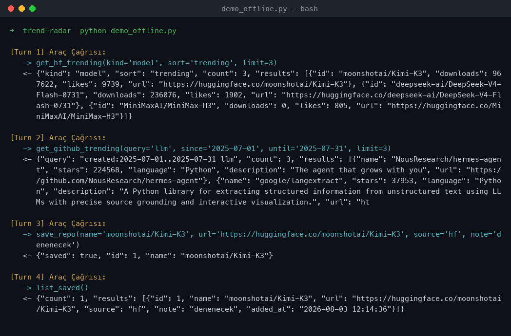

# 📡 ML Trend Radar — Tool Calling Asistanı

Bir LLM'in **Tool Calling / Function Calling** ile dış dünyaya (Hugging Face
Hub API + GitHub Search API) bağlanıp **gerçek** veri çektiği, beğenilen
öğeleri de SQLite'taki kişisel takip listesine kaydeden asistan.

Çözdüğü sorun: ML/AI dünyası çok hızlı; "bugün neler trend, geçen ay hangi
repolar patladı, ben hangilerini denemek istemiştim" sorularını tek yerden
yanıtlıyor. Bütün sayısal veriler ve isimler araçlardan gelir — model
**hiçbir şey uydurmaz**.

## Senaryo & Mimari

| Katman | Görev |
|--------|-------|
| `app.py` | Gradio arayüzü + agentic döngü (model → araç → geri besleme → yanıt) |
| `tools.py` | 4 aracın implementasyonu + modele verilen OpenAI uyumlu JSON şemalar |
| `db.py` | SQLite bağlantısı + `watchlist` tablosu |
| HF Inference API | Tool-calling destekli model (varsayılan `Qwen/Qwen2.5-72B-Instruct`) |
| Hugging Face Hub API | Trend / en çok indirilen model & dataset (key gerekmez) |
| GitHub Search API | Tarih aralığına göre en çok yıldızlı (trend) repolar |

## Araçlar (Tool Definitions)

- **`get_hf_trending(kind, sort, limit)`** → HF'te trend/en çok indirilen
  `model` veya `dataset` listesi. `sort`: `trending` | `downloads` | `likes`.
- **`get_github_trending(query, since, until, language, limit)`** → GitHub'da
  `created:since..until` aralığında en çok yıldızlı repolar. Tarih verilmezse
  son 7 gün. *(GitHub'da "indirilme" metriği olmadığı için trend karşılığı
  olarak yıldız kullanıldı.)*
- **`save_repo(name, url, source, note)`** → seçileni SQLite `watchlist`'e yazar.
- **`list_saved(source)`** → kaydedilen öğeleri okur (`hf`/`github` filtresi opsiyonel).

İlk ikisi **veri okur** (dış API), `save_repo` **veri yazar**, `list_saved`
**DB'den okur** → ödevin "hem oku hem yaz" şartı karşılanır.

## Halüsinasyon Engelleme

- System prompt modele "yalnızca araçlardan dönen gerçek veriyle yanıtla,
  isim/sayı uydurma" der.
- Trend listeleri **canlı API'den**, takip listesi **yalnızca DB'den** gelir.
- Veri boş dönerse model bunu dürüstçe söyler.

## Örnek Çalışma Akışı

Kullanıcı: *"Bugünün trend modellerinden ilkini takip listeme ekle, sonra listemi göster."*
Arka planda tetiklenen tool-call'lar (`ornek-log.txt` — gerçek çıktı):

```
[Turn 1] Araç Çağrısı:
   -> get_hf_trending(kind='model', sort='trending', limit=3)
   <- {"kind": "model", "count": 3, "results": [{"id": "moonshotai/Kimi-K3", "downloads": 967622, "likes": 9739, ...}, ...]}

[Turn 2] Araç Çağrısı:
   -> get_github_trending(query='llm', since='2025-07-01', until='2025-07-31', limit=3)
   <- {"query": "created:2025-07-01..2025-07-31 llm", "count": 3, "results": [{"name": "NousResearch/hermes-agent", "stars": 224568, ...}, ...]}

[Turn 3] Araç Çağrısı:
   -> save_repo(name='moonshotai/Kimi-K3', url='...', source='hf', note='denenecek')
   <- {"saved": true, "id": 1, "name": "moonshotai/Kimi-K3"}

[Turn 4] Araç Çağrısı:
   -> list_saved()
   <- {"count": 1, "results": [{"id": 1, "name": "moonshotai/Kimi-K3", "source": "hf", "added_at": "2026-08-03 12:14:36"}]}
```

Terminal çıktısı (araçların gerçekten API + SQLite'a gittiğini gösteren log):



> Not: yukarıdaki `python demo_offline.py` çıktısı (LLM'siz, sadece araç boru
> hattı). HF Space'e deploy edince Gradio arayüzünden alınan ekran görüntüsünü
> de ekleyeceğim. Ham metin: `ornek-log.txt`.

## Yerel Çalıştırma

```bash
pip install -r requirements.txt

# LLM'siz sadece araçları test et (HF_TOKEN gerekmez):
python demo_offline.py

# Tam asistan (Gradio arayüzü):
export HF_TOKEN=hf_xxx            # kendi token'ınız
# export GITHUB_TOKEN=ghp_xxx    # opsiyonel, GitHub rate-limit'i yükseltir
python app.py                    # http://127.0.0.1:7860
```

## Canlı Demo & Deploy

- 🖥️ **HF Space (tanıtım sayfası):** https://huggingface.co/spaces/ssilistre/ml-trend-radar

Free Hugging Face hesabı **Gradio** Space için artık PRO istiyor (yalnızca
Static Space ücretsiz). Uygulama gerçek sunucu gerektirdiğinden (API çağrıları
+ SQLite + gizli `HF_TOKEN`) çalışan arayüzü iki şekilde koşabilirsin:

- **Yerel (önerilen):** aşağıdaki *Yerel Çalıştırma* adımları — `python app.py`.
- **Tek tık bulut (opsiyonel):** repodaki `render.yaml` ile
  [Deploy to Render](https://render.com/deploy?repo=https://github.com/unkownpr/4hafta-odev);
  Render `HF_TOKEN`'ı deploy sırasında sorar.
- **PRO hesabın varsa:** `app.py, tools.py, db.py, requirements.txt` dosyalarını
  doğrudan bir Gradio HF Space'e yükleyip `HF_TOKEN` secret'ı ekle.

## Notlar

- HF Hub API ve GitHub Search API key gerektirmez; yalnızca LLM çağrısı için `HF_TOKEN` gerekir.
- GitHub Search API token'sız **10 istek/dk** ile sınırlı; yoğun kullanımda `GITHUB_TOKEN` ekleyin.
- `MAX_TURNS` ile araç döngüsü sonsuza gitmez.
- `watchlist.db` `.gitignore`'da; ilk çalıştırmada otomatik oluşturulur.
